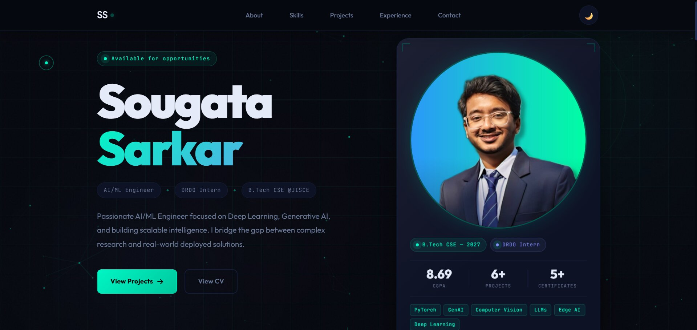

# Sougata Sarkar — Professional Portfolio

 <!-- Adjust if you have a UI screenshot later -->

> A high-performance, dynamic personal portfolio website demonstrating my skills, projects, and professional experience as an AI/ML Engineer.

## 🚀 Live Demo

[https://sougata2205.github.io/Portfolio](https://sougata2205.github.io/Portfolio)

## ✨ Key Features

This portfolio is built with a focus on modern web aesthetics, smooth animations, and high performance:

*   **Dynamic Interactive Hero:** Synchronised typing effect on the header with a responsive 3D tilt photo card.
*   **Interactive Particle Canvas:** A custom HTML5 Canvas-based background featuring particles that react magnet-like to cursor proximity.
*   **Custom Smooth Cursor:** A customized, snappy cursor ring and dot that transform seamlessly upon hover and click states across interactive elements.
*   **Project Showcase Filtering:** Smooth, animated filtering system categorizing work by ML/DL, Web/App, and Hardware projects.
*   **Scroll Reveal Animations:** Intersection Observer API utilizing staggered reveal effects as you scroll down the page.
*   **Theme Management:** Dark and light mode seamless toggling.
*   **Responsive & Accessible:** Fully styled using responsive CSS to look great on mobile, tablet, and high-res desktops.

## 🛠️ Built With

*   **HTML5** (Semantic structure)
*   **Vanilla CSS3** (Custom properties, grid, flexbox, keyframe animations, glassmorphism UI)
*   **Vanilla JavaScript (ES6+)** (Canvas API, Intersection Observers, DOM manipulation without heavy frameworks)

## 👤 About Me

I am an **AI/ML Engineer** and **DRDO Intern** with a focus on Deep Learning, Generative AI, and deploying scalable intelligence. I bridge the gap between complex research and real-world deployed solutions.

Currently pursuing my B.Tech in Computer Science & Engineering at JIS College of Engineering.

## 💻 Included Projects

*   **DRDO Project:** Audio-based Aerial Target Classification (CNN, GRU, LSTM).
*   **Health Sathi:** Multimodal AI assistant with GenAI and RAG.
*   **Alzheimer Predictor:** Multi-class classification using ResNet-50 + ViT.
*   **Breast Cancer Predictor:** ML-based web app predicting Benign/Malignant cases with high accuracy.
*   **Hardware Robotics:** Custom-built SandRover and Line-following robots.

## 🏃‍♂️ Getting Started Locally

To run this project locally, simply clone the repository and open `index.html` in your browser. No build steps or package managers required.

```bash
# Clone the repository
git clone https://github.com/SOUGATA2205/Portfolio.git

# Navigate into the directory
cd Portfolio

# Open it in your default browser (or use live-server)
# On Windows:
start index.html
# On macOS:
open index.html
# On Linux:
xdg-open index.html
```

## 📫 Connect with me

*   **LinkedIn:** [linkedin.com/in/sougata22](https://www.linkedin.com/in/sougata22)
*   **GitHub:** [github.com/SOUGATA2205](https://github.com/SOUGATA2205)
*   **Email:** [sougatajisce@gmail.com](mailto:sougatajisce@gmail.com)

---

*Designed and engineered by Sougata Sarkar.*
